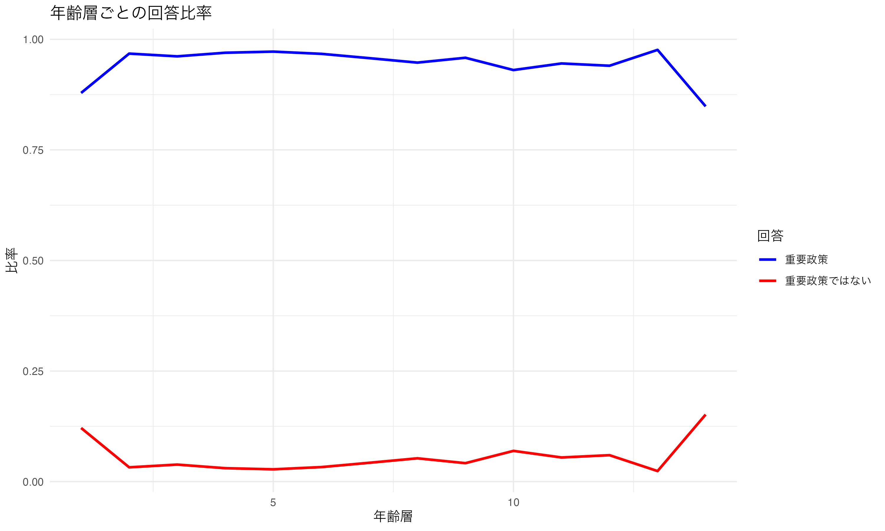
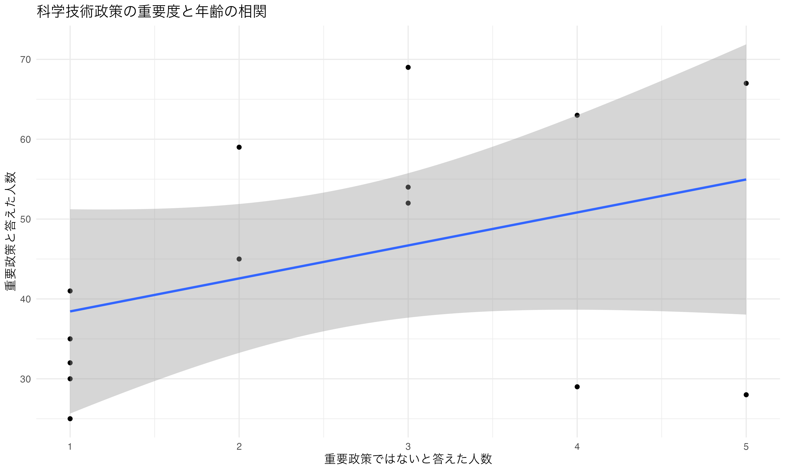

# 情報通信政策の重要度と年齢の関係性分析

## 分析手法

1. 相関分析
   - 重要政策と答えた人数（Positive）と重要政策ではないと答えた人数（Negative）の相関を分析
2. 回帰分析
   - 重要政策と答えた人数を従属変数、重要政策ではないと答えた人数を独立変数として回帰分析を実行
3. 年齢層ごとの比率分析
   - 各年齢層における回答の比率を計算

## 分析結果

### 1. 相関分析の結果

- 相関係数: 0.3984
- p値: 0.1583
- 95%信頼区間: [-0.168, 0.767]
- 統計的に有意な相関は認められないが、中程度の正の相関が示唆される

### 2. 回帰分析の結果

- 切片: 34.306 (p値: 0.00116**)
- 傾き: 4.131 (p値: 0.15832)
- 決定係数（R-squared）: 0.1587
- 調整済み決定係数: 0.08857
- モデルの適合度は低く、統計的に有意な関係は認められない

### 3. 年齢層ごとの回答比率

| 年齢層 | 重要政策と答えた比率 | 重要政策ではないと答えた比率 |
|------------|---------------------|----------------------------|
| 1(16-19歳) | 87.88% | 12.12% |
| 2(20-24歳) | 96.77% | 3.23% |
| 3(25-29歳) | 96.15% | 3.85% |
| 4(30-34歳) | 96.97% | 3.03% |
| 5(35-39歳) | 97.22% | 2.78% |
| 6(40-44歳) | 96.72% | 3.28% |
| 7(45-49歳) | 95.74% | 4.26% |
| 8(50-54歳) | 94.74% | 5.26% |
| 9(55-59歳) | 95.83% | 4.17% |
| 10(60-64歳)| 93.06% | 6.94% |
| 11(65-69歳)| 94.55% | 5.45% |
| 12(70-74歳)| 94.03% | 5.97% |
| 13(75-79歳)| 97.62% | 2.38% |
| 14(80歳以上)| 84.85% | 15.15% |

### 4. 視覚化

#### 相関分析の結果

#### 年齢層ごとの回答比率

## 結論

1. 相関分析と回帰分析の結果から、重要政策と答えた人数と重要政策ではないと答えた人数の間に**統計的に有意な関係は認められないが、中程度の正の相関が示唆される。**

2. 年齢層ごとの回答比率を見ると：
   - ほとんどの年齢層で、重要政策と答えた人の割合が90%以上と高い
   - 特に注目すべき点として：
     - 16-19歳（87.88%）と80歳以上（84.85%）で比較的低い値を示している
     - 35-39歳（97.22%）と75-79歳（97.62%）で最も高い値を示している
   - 重要政策ではないと答えた人の割合は、16-19歳（12.12%）と80歳以上（15.15%）で比較的高い

3. 全体として、情報通信政策の重要度に関する認識は年齢層による若干の違いが見られ、特に若年層（16-19歳）と高齢層（80歳以上）で重要度の認識が若干低い傾向があることが示唆される。ただし、どの年齢層でも80%以上の回答者が情報通信政策を重要と認識している。
