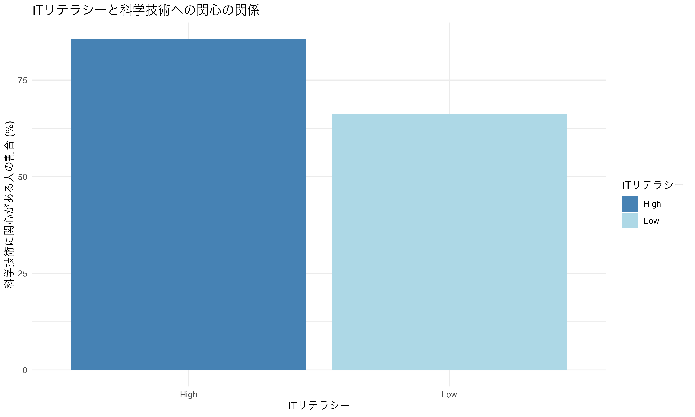
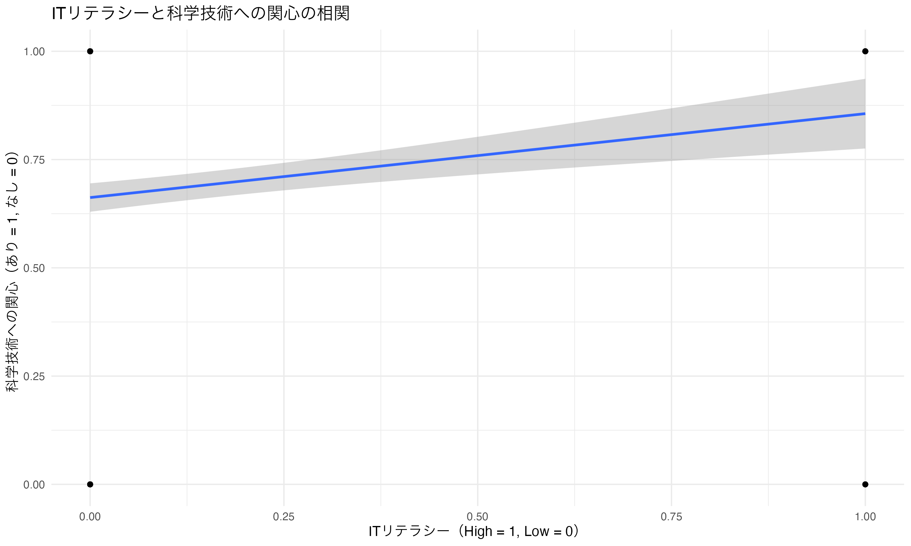

# ITリテラシーと科学技術への関心の関係性分析

## 分析手法

1. 基本統計分析
   - ITリテラシーの高低による回答者の分布を分析
2. カイ二乗検定
   - ITリテラシーと科学技術への関心の関連性を検定
3. 相関分析
   - ITリテラシーと科学技術への関心の相関関係を分析
4. 回帰分析
   - ITリテラシーが科学技術への関心に与える影響を分析

## 分析結果

### 1. 基本統計

- ITリテラシーが高い人の総数: 125人
- ITリテラシーが低い人の総数: 752人

### 2. 科学技術への関心

- ITリテラシーが高い人の中で科学技術に関心がある人の割合: 85.6%
- ITリテラシーが低い人の中で科学技術に関心がある人の割合: 66.22%

### 3. カイ二乗検定の結果

- カイ二乗値: 17.914
- 自由度: 1
- p値: 2.311e-05
- 統計的に有意な関連性が認められる（p < 0.001）

### 4. 相関分析の結果

- 相関係数: 0.146
- p値: 1.335e-05
- 95%信頼区間: [0.081, 0.211]
- 統計的に有意な正の相関が認められる

### 5. 回帰分析の結果

- 切片: 0.662 (p < 2e-16***)
- 傾き: 0.194 (p = 1.34e-05***)
- 決定係数（R-squared）: 0.02145
- 調整済み決定係数: 0.02033
- モデルは統計的に有意（F値: 19.18, p = 1.335e-05）

## 結論

1. ITリテラシーと科学技術への関心には統計的に有意な正の相関関係が認められる。

2. ITリテラシーが高い人（85.6%）は、ITリテラシーが低い人（66.22%）と比較して、科学技術への関心が高い傾向にある。

3. 回帰分析の結果から、ITリテラシーの高低が科学技術への関心に影響を与えていることが示唆される。ただし、決定係数が低い（R-squared = 0.02145）ことから、他の要因も関心に影響を与えている可能性が高い。

4. 全体として、ITリテラシーの向上が科学技術への関心の向上につながる可能性が示唆される。相関係数（0.146）は前回の分析（0.096）と比較して若干高い値を示しており、より強い関連性が認められる。

## 視覚化

### ITリテラシーと科学技術への関心の関係

### 相関関係の散布図

## 参照：ソースコード

[ソースコード](../..//analysis/skill_relation/Q8_19_skill.R)
