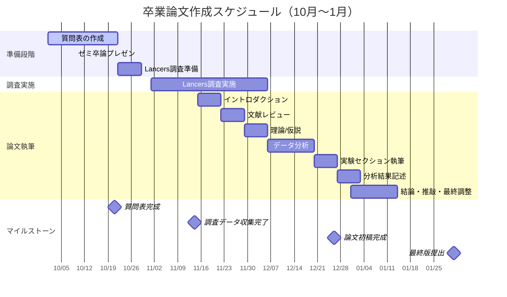

# 卒業論文作成スケジュール

## Todo

1. 質問表の作成
2. オンラインサーベイで実験・調査を行う
3. 実験・分析以外のセクションを書き進める
   1. イントロダクション
   2. 文献レビュー
   3. 理論/仮説
4. 実験・分析のセクションを書き進める
   1. データ／関連概念の測定方法
   2. 分析
   3. 結論

## メインガントチャート

## 10/9　ゼミ卒論プレゼン内容

- 仮説の確認
- 質問表の確認

質問表
デザイン

質問画面
- GoogleForm
- 自作のWebサイト
  - githubpagesで公開してJSでどこかのDBに送信できるのか

qualtrcs